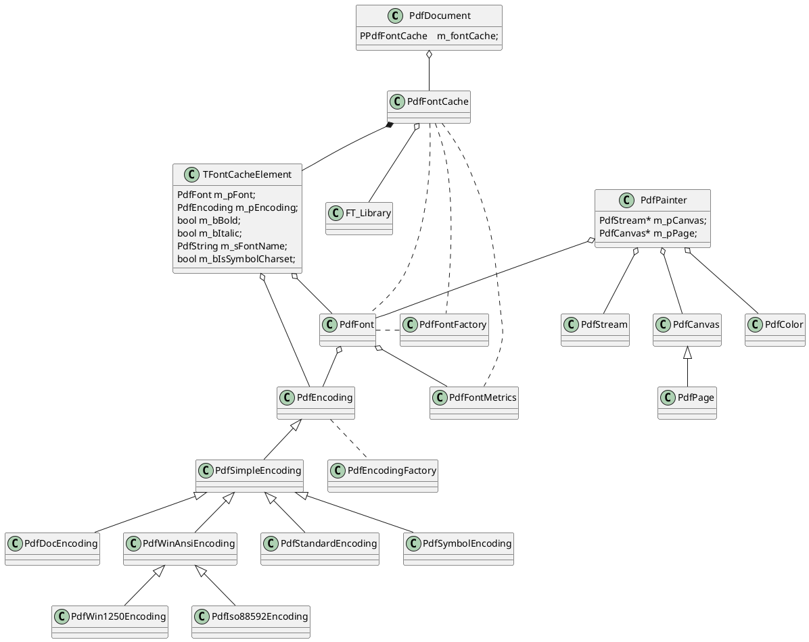
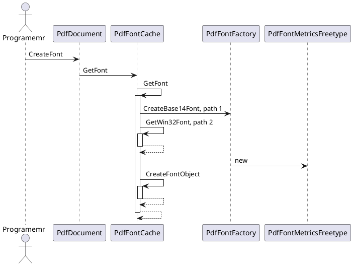
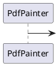

# Font management

## Classes

```plantuml
@startuml
class PdfDocument {
    PPdfFontCache    m_fontCache;
}
PdfDocument o-- PdfFontCache

PdfFontCache *-- TFontCacheElement
PdfFontCache o-- FT_Library
PdfFontCache ... PdfFont
PdfFontCache ... PdfFontMetrics
PdfFontCache ... PdfFontFactory

class TFontCacheElement {
    PdfFont m_pFont;
    PdfEncoding m_pEncoding;
    bool m_bBold;
    bool m_bItalic;
    PdfString m_sFontName;
    bool m_bIsSymbolCharset;
}

TFontCacheElement o-- PdfFont
PdfFont o-- PdfFontMetrics
PdfFont o-- PdfEncoding
PdfFont . PdfFontFactory

TFontCacheElement o-- PdfEncoding
PdfEncoding <|-- PdfSimpleEncoding
PdfSimpleEncoding <|-- PdfDocEncoding
PdfSimpleEncoding <|-- PdfWinAnsiEncoding
PdfSimpleEncoding <|-- PdfStandardEncoding
PdfSimpleEncoding <|-- PdfSymbolEncoding
PdfWinAnsiEncoding <|-- PdfWin1250Encoding
PdfWinAnsiEncoding <|-- PdfIso88592Encoding

PdfEncoding .. PdfEncodingFactory

class PdfPainter{
    PdfStream* m_pCanvas;
    PdfCanvas* m_pPage;
}

PdfPainter o-- PdfFont
PdfPainter o-- PdfStream
PdfPainter o-- PdfCanvas
PdfPainter o-- PdfColor

PdfCanvas <|-- PdfPage
@enduml
```

## Create font

```plantuml
@startuml
actor Programemr
Programemr -> PdfDocument:CreateFont
PdfDocument -> PdfFontCache:GetFont
PdfFontCache -> PdfFontCache++:GetFont

' use build in font
PdfFontCache -> PdfFontFactory:CreateBase14Font, path 1

' load system font without a path
PdfFontCache -> PdfFontCache++:GetWin32Font, path 2
return

' load font with path
PdfFontFactory -> PdfFontMetricsFreetype:new
PdfFontCache -> PdfFontCache++:CreateFontObject
return

return
@enduml
```

## Draw text

```plantuml
@startuml
PdfPainter -> 
@enduml
```
